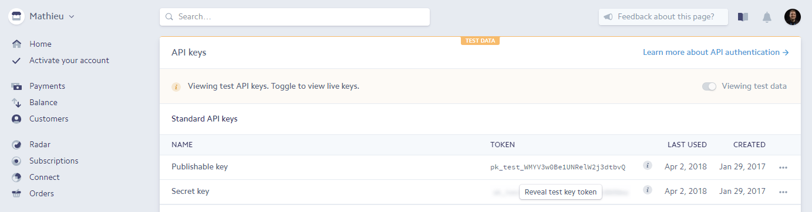
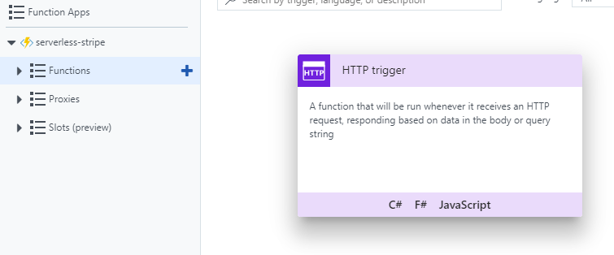

## Comment accepter des paiements Stripe en 5 minutes gr­ace aux Azure Functions

### 1. Ouvrir un compte Stripe et obtenir les clés d'API



### 2. Créer la fonction serverless



index.js
```javascript
var stripe = require('stripe');

function parseRawBody(raw) {
    var body = {};
    var items = raw.substr(0).split('&');
    for (var i = 0; i < items.length; i++) {
        var item = items[i].split('=');
        body[decodeURIComponent(item[0])] = decodeURIComponent(item[1] || '').replace(new RegExp("\\+", 'g'), ' ');
    }
    return body;
}

module.exports = function(context, req) {
    var body = parseRawBody(req.body);

    stripe(process.env.stripeKey).charges.create({
        amount: 250,
        currency: 'cad',
        source: body.stripeToken,
        description: 'Cafe'
    }, function (error, response) {
        if (error) context.log.error(error.message);
        if (response) context.log.info(JSON.stringify(response));

        context.res.status = (error ? 400 : 200);
        context.res.setHeader('content-type', 'text/html; charset=utf-8');
        context.res.raw('<h1>' + (error ? error.message : 'Merci beaucoup!') + '</h1>');
    });
}
```

#### Code front-end:

index.html
```html
<form action="{serverless_function_url}" method="POST">
  <script
    src="https://checkout.stripe.com/checkout.js"
    class="stripe-button"
    data-key="{stripe_public_key}"
    data-image="assets/whatever.png"
    data-name="name..."
    data-description="description..."
    data-amount="250"
    data-locale="auto"
    data-panel-label="panel-label..."
    data-label="label...">
  </script>
</form>
```

### Résultat:

<form action="https://serverless-stripe.azurewebsites.net/api/AcceptStripePayments?code=zkkdkOXIJcasXgXaWbMFedS9ITqMrgJJPcO7nOWtSTkoMvwFWvpayw==" method="POST">
  <script
    src="https://checkout.stripe.com/checkout.js"
    class="stripe-button"
    data-key="pk_test_WMYV3w0Be1UNRelW2j3dtbvQ"
    data-image="assets/mathieu.jpg"
    data-name="Blog de Mathieu"
    data-description="Un petit encouragement?"
    data-amount="250"
    data-locale="auto"
    data-panel-label="2.50$ pour m'encourager"
    data-label="2.50$ pour m'encourager">
  </script>
</form>

Note: Vous pouvez essayer le bouton avec une carte de crédit de test (ex: 4242 4242 4242 4242).
